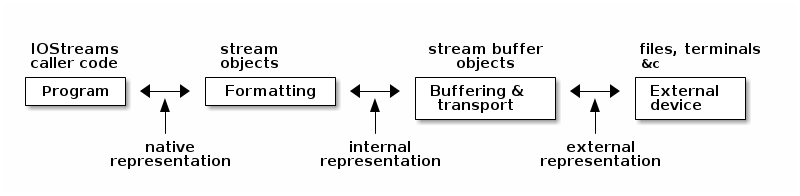

# Introduction & Motivation

While working on a personal project recently, I sat down to implement `operator<<` for a class I'd written. This class had textual members, and that text could exist in a number of encodings (ISO-8859-1, UTF-8, Windows 1252, and so forth). I quickly realized I had no idea how to implement this in a general way; one that would work regardless of the stream character type, character traits, imbued locale &c. For instance, if I had ISO-8859-1 encoded text, and was asked to insert that into a wide stream, what encoding should I use? I was pretty sure calling `widen` wasn't the right thing to do, any more than `narrow`-ing a UTF-16 encoded string would work if I had to insert it into a narrow stream.

Beyond that, the first character stream into which my implementation would be writing was `cout`, since the project included a program that would print this text to `stdout`. Even if I could figure out how to get my text into a `basic_ostream<char>`, I really wasn't sure what was going to happen on the other end, in my xterm.

I started Googling, but the more I read, the further down a rabbit-hole I felt. This document started out as a place to collect what I learned as I read, but has turned into one of those "survey" papers pulling together the extant on-line literature on character encodings & IOStreams on the way to understanding all of this.


# Character Encodings


## Background

I'd like to start at the beginning & explore the state of character encodings. Spolksy has the classic write-up on this [[1](#orgfb1cf93)]; it's a bit dated (2003) but still very relevant.

A character encoding is a mapping from the non-negative integers to characters for purposes of representing text conveniently in a computer program. Back when I was learning to program on an [Apple II+](https://en.wikipedia.org/wiki/Apple_II_Plus), this was simple: we just used [ASCII](http://www.asciitable.com/). ASCII got it start in 1961, when Bob Bemer sent a proposal to the American National Standards Institute (ANSI) for the development of a standardized way to represent letters, numbers, punctuation marks and control codes among computers.

Zero was used to represent a NUL, or NOP, one through thirty-one were used for assorted codes used in the control of the electro-mechanical devices in use at the time, thirty-two was space, thirty-tree through forty-seven were used for assorted punctuation characters, then the digits, upper- and lower-case letters. One hundred twenty-seven represented '~'.

[ASCII Code Chart](img/US-ASCII_code_chart.png) [[25](#orgae36f2c)]

The upshot is that you only needed 7 bits to represent all the characters you needed in the English language as used in the United States. Since ASCII stands for the **American** Standard Code for Information Interchange, I would argue that the standard did its job admirably; the world just needed a bigger standard.

To that point, there were of course many people in the world who wanted to represent **other** characters. And by that time, all popular architectures used eight-bit bytes, leaving 128 more numeric values that could be represented with a byte, which people immediately set about doing. Unfortunately, there are a lot more than 128 characters non-American English speakers wanted to represent, which led to a lot incompatible ways of mapping characters in various alphabets to bytes. For instance, there's the ISO/IEC 8859 [[8](#orgc960941)] series of eight-bit character mappings. Western readers will recognize "ISO-8859-1", that's the mapping that contains the Latin alphabet),


but the standard covered many other languages, as well:

| Part | Name                             | Description                                                                                                                                                                                                                                                                                                                                                                                                                                                                                                                                                                                                                                                                   |
|---- |-------------------------------- |----------------------------------------------------------------------------------------------------------------------------------------------------------------------------------------------------------------------------------------------------------------------------------------------------------------------------------------------------------------------------------------------------------------------------------------------------------------------------------------------------------------------------------------------------------------------------------------------------------------------------------------------------------------------------- |
| 1    | Latin-1, Western European        | Perhaps the most widely used part of ISO/IEC 8859, covering most Western European languages: Danish (partial),[nb 1] Dutch (partial),[nb 2] English, Faeroese, Finnish (partial),[nb 3] French (partial),[nb 3] German, Icelandic, Irish, Italian, Norwegian, Portuguese, Rhaeto-Romanic, Scottish Gaelic, Spanish, Catalan, and Swedish. Languages from other parts of the world are also covered, including: Eastern European Albanian, Southeast Asian Indonesian, as well as the African languages Afrikaans and Swahili. The missing euro sign and capital Ÿ are in the revised version ISO/IEC 8859-15 (see below). The corresponding IANA character set is ISO-8859-1. |
| 2    | Latin-2, Central European        | Supports those Central and Eastern European languages that use the Latin alphabet, including Bosnian, Polish, Croatian, Czech, Slovak, Slovene, Serbian, and Hungarian. The missing euro sign can be found in version ISO/IEC 8859-16.                                                                                                                                                                                                                                                                                                                                                                                                                                        |
| 3    | Latin-3, South European          | Turkish, Maltese, and Esperanto. Largely superseded by ISO/IEC 8859-9 for Turkish and Unicode for Esperanto.                                                                                                                                                                                                                                                                                                                                                                                                                                                                                                                                                                  |
| 4    | Latin-4, North European          | Estonian, Latvian, Lithuanian, Greenlandic, and Sami.                                                                                                                                                                                                                                                                                                                                                                                                                                                                                                                                                                                                                         |
| 5    | Latin/Cyrillic                   | Covers mostly Slavic languages that use a Cyrillic alphabet, including Belarusian, Bulgarian, Macedonian, Russian, Serbian, and Ukrainian (partial).[nb 4]                                                                                                                                                                                                                                                                                                                                                                                                                                                                                                                    |
| 6    | Latin/Arabic                     | Covers the most common Arabic language characters. Doesn't support other languages using the Arabic script. Needs to be BiDi and cursive joining processed for display.                                                                                                                                                                                                                                                                                                                                                                                                                                                                                                       |
| 7    | Latin/Greek                      | Covers the modern Greek language (monotonic orthography). Can also be used for Ancient Greek written without accents or in monotonic orthography, but lacks the diacritics for polytonic orthography. These were introduced with Unicode.                                                                                                                                                                                                                                                                                                                                                                                                                                     |
| 8    | Latin/Hebrew                     | Covers the modern Hebrew alphabet as used in Israel. In practice two different encodings exist, logical order (needs to be BiDi processed for display) and visual (left-to-right) order (in effect, after bidi processing and line breaking).                                                                                                                                                                                                                                                                                                                                                                                                                                 |
| 9    | Latin-5, Turkish                 | Largely the same as ISO/IEC 8859-1, replacing the rarely used Icelandic letters with Turkish ones.                                                                                                                                                                                                                                                                                                                                                                                                                                                                                                                                                                            |
| 10   | Latin-6, Nordic                  | A rearrangement of Latin-4. Considered more useful for Nordic languages. Baltic languages use Latin-4 more.                                                                                                                                                                                                                                                                                                                                                                                                                                                                                                                                                                   |
| 11   | Latin/Thai                       | Contains characters needed for the Thai language. Virtually identical to TIS 620.                                                                                                                                                                                                                                                                                                                                                                                                                                                                                                                                                                                             |
| 12   | Latin/Devanagari                 | The work in making a part of 8859 for Devanagari was officially abandoned in 1997. ISCII and Unicode/ISO/IEC 10646 cover Devanagari.                                                                                                                                                                                                                                                                                                                                                                                                                                                                                                                                          |
| 13   | Latin-7, Baltic Rim              | Added some characters for Baltic languages which were missing from Latin-4 and Latin-6.                                                                                                                                                                                                                                                                                                                                                                                                                                                                                                                                                                                       |
| 14   | Latin-8, Celtic                  | Covers Celtic languages such as Gaelic and the Breton language.                                                                                                                                                                                                                                                                                                                                                                                                                                                                                                                                                                                                               |
| 15   | Latin-9                          | A revision of 8859-1 that removes some little-used symbols, replacing them with the euro sign € and the letters Š, š, Ž, ž, Œ, œ, and Ÿ, which completes the coverage of French, Finnish and Estonian.                                                                                                                                                                                                                                                                                                                                                                                                                                                                        |
| 16   | Latin-10, South-Eastern European | Intended for Albanian, Croatian, Hungarian, Italian, Polish, Romanian and Slovene, but also Finnish, French, German and Irish Gaelic (new orthography). The focus lies more on letters than symbols. The currency sign is replaced with the euro sign.                                                                                                                                                                                                                                                                                                                                                                                                                        |

[[26](#org6ca567b)]

Operating system writers & computer manufacturers at the time did the same thing less formally; the mappings were known as [Code Pages](http://www.i18nguy.com/unicode/codepages.html#msftdos). A Code Page is again a mapping of numbers to characters that (usually) agreed with ASCII for values 0-127 and used 128-255 to represent a given nation or language's particular characters. Again, you may recognize ["Windows-1252"](https://en.wikipedia.org/wiki/Windows-1252), or "CP-1252" even today; this refers to the Code Page Windows used for Latin alphabets (but there are many [others](https://msdn.microsoft.com/en-us/library/windows/desktop/dd317756(v=vs.85).aspx)). Windows-1252 is similar to ISO-8859-1, but slightly different; for example 0x80 corresponds to the Euro sign € in Windows-1252, but is unassigned in ISO-8859-1.

This was definitely a step forward for localizing computer programs for non-American English speakers, but this arrangement presented a lot of drawbacks. Firstly, no convention ever emerged for carrying the encoding along with the text, so it was easy to save text in one encoding & then attempt to load it with another (resulting in gibberish).

Only one code page could be active at a time; for instance, Israel used Code Page 862 & Greece 737 on Windows. Trying to display Hebrew & Greek at the same time was impossible (using code pages).

Asian languages had thousands of characters they needed to represent, which of course couldn't fit into a single byte, leading to what was known as DBCS (Double Byte Character Sets). Despite the name, some characters were represented as one byte & some as two. You had to examine the first byte to figure out whether it represented a character on its own, or whether you needed to scan the next byte to figure out what you had.

For instance, consider GBK, used to encode simplified Mandarin characters in mainland China. GBK was setup to agree with ASCII over [0,128); if the high bit is set, however, the byte is the first in a two-byte sequence. In simplified Mandarin "world" is 世界, so "Hello,世 界" would be encoded in GBK as `48 65 6C 6C 6F 2C 20 CA C0 BD E7`:

| 48 | 65 | 6C | 6C | 6F | 2C | 20 | CA C0 | BD E7 |
|--- |--- |--- |--- |--- |--- |--- |----- |----- |
| H  | e  | l  | l  | o  | ,  |    | 世    | 界    |

Notice that iterating over the characters of such a string is no longer a matter of incrementing a pointer. Scanning a string backward in such an encoding requires examining the **preceeding** byte to see if the current byte is a character on its own, or is the second byte in a two-byte sequence.

State-dependent encodings were even more complex in that you had to have access to the entire character stream to interpret it because they could change the encoding for subsequent characters through an escape sequence. For instance, ISO-2022-JP works as follows:

-   text begins using the ASCII encoding
-   at any point, an escape sequence can "shift" the encoding scheme to a different one:
    -   **ESC ( J:** JIS X 0201-1976 coded character set
    -   **ESC $ @:** JIS X 0208-1978 CCS
    -   **ESC $ B:** JIS X 0208-1983 CCS
    -   **ESC ( B:** ASCII

JIS X 201 is the so called "Roman" character set; it's identical to ASCII except for backslash & tilde, which are replaced by the Yen sign and an overline, respectively. The others consist of Hiragana, Katakana (two Japanese character sets), Kanji (Chinese characters commonly used in Japan), and other assorted symbols. Each character takes one or two bytes. [[27](#orgc699e1f)]

So while today my wife & I can easily text one another using a combination of Mandarin characters & English letters, that was a crazy, far-off dream in the late 80s & early 90s.


## Unicode

Around that time, however, lie the beginnings of Unicode. The idea was to come up with a universal character encoding that could represent all characters in all languages:

> Unicode is intended to address the need for a workable, reliable world text encoding. Unicode could be roughly described as "wide-body ASCII" that has been stretched to 16 bits to encompass the characters of all the world's living languages. In a properly engineered design, 16 bits per character are more than sufficient for this purpose. [[2](#org701b737)]

The idea was to simply write down all the characters anyone around the world wanted to encode, assign them numbers, and use one, universal encoding scheme; no more code pages, no more variable-width encodings, no more escape codes & no more mangled text (since everyone would be using one character encoding). The encoding was known as "UCS-2" (Universal Character Set in 2 chars). It was beguiling, and I recall that at the time it was a mark of modernity & forward thinking for new systems to announce that they would use Unicode to represent text:

> In the following years many systems &#x2026; added support for Unicode and switched to the UCS-2 encoding. It was especially attractive for new technologies, such as the Qt framework (1992), Windows NT 3.1 (1993) and Java (1995). [[9](#orgc3bab82)]

As is frequently the case, things turned out to not be so simple in practice; three problems became apparent. The first was that all legacy code treating characters as a single byte needed to be updated or accomodated, leading to things like this:

```c
#ifdef UNICODE
#   define _T(x) Lx
#   define _tcslen wcslen
...
#else
#   define _T(x) x
#   define _tcslen strlen
...
#endif

...

_tcslen(_T("Hello, world"));
```

The idea here is that the API (Win32, in this case) would define both narrow- & wide-character versions of all methods taking text and that the application developer would select which representation they wanted by defining (or not) the `UNICODE` preprocessor macro.

Secondly, the representation of text in English (or any form of expression that could be handled by ASCII or some eight-bit-encoded superset thereof) was now doubled in size. To add insult to injury, the added bulk would all be zeroes.

Finally, two bytes turned out to be not enough; Unicode 9.0.0 defines 128,172 characters [[5](#org2ce6d29)] As [[7](#org6a65695)] notes, this was a killer; if two bytes were not enough to represent all characters, then we were right back where we started.


### So What Exactly Is Unicode & Where Is It Today?

I want to start by saying that Nathan Reed's [A Programmer's Introduction to Unicode](http://reedbeta.com/blog/programmers-intro-to-unicode/) [[10](#org31dc7ba)] is the best overview of the topic I've found.

-   Code Points & the Unicode Code Space

    > [Unicode](http://unicode.org/) provides a unique number for every character&#x2026;
    
    That's not quite right, as we'll see, but let's start with the statement that Unicode defines a set of **code points**. Each code point has a number, by convention expressed in hexadecimal with the prefix "U+". For example, U+0041 (decimal 65) is 'A' (LATIN CAPITAL LETTER A) [[17](#org054f5a8)]. The range of available values is the Unicode **code space**, defined to be the intervalf 0 to 0x10FFFF [[18](#org5bec48e)], inclusive. We still think in terms of 64K chunks, termed **code planes**, so this gives us 17 code planes of 65,536 code points each. Plane 0 comprises the code points 0 to 0xFFFF, code plane 1 the code points 0x10000 to 0x1FFFF, code plane 2 the code points from 0x20000 to 0x2FFFF, and so forth.
    
    > Plane 0 is also known as the “Basic Multilingual Plane”, or BMP. The BMP contains essentially all the characters needed for modern text in any script, including Latin, Cyrillic, Greek, Han (Chinese), Japanese, Korean, Arabic, Hebrew, Devanagari (Indian), and many more.
    > 
    > (In the past, the codespace was just the BMP and no more—Unicode was originally conceived as a straightforward 16-bit encoding, with only 65,536 code points. It was expanded to its current size in 1996. However, the vast majority of code points in modern text belong to the BMP.)
    > 
    > Plane 1 contains historical scripts, such as Sumerian cuneiform and Egyptian hieroglyphs, as well as emoji and various other symbols. Plane 2 contains a large block of less-common and historical Han characters. The remaining planes are empty, except for a small number of rarely-used formatting characters in Plane 14; planes 15–16 are reserved entirely for private use. [[10](#org31dc7ba)]
    
    Here's a visual representation of the planes:
    
    [Code Planes](img/unicodeplanes.png)
    
    Today, the Unicode code space encodes 135 different scripts and 1100 languages. There are still over 100 unsupported scripts, both modern and historical, which people are still [working](http://linguistics.berkeley.edu/sei/) to add. [[10](#org31dc7ba)]

-   Graphemes from Code Points

    While most code points correspond directly to what we would call characters (such as U+0041: 'A', LATIN CAPITAL LETTER A), that is not always the case. Several languages include characters that can be modified by the addition of what I'll call accent marks before introducing the correct term. Western readers will be most familiar with the accent marks used in various European languages such as À (A with an accent grave), but there are similar arrangements in Arabic, Hebrew, Korean & some south Asian languages. Such accent marks are more generally known as diacritics; "a glyph added to a letter, or basic glyph" [[20](#org3e941f3)].
    
    Worse, multiple accents can be applied to a letter (e.g. U+1EBF: ế, LATIN SMALL LETTER E WITH CIRCUMFLEX AND ACUTE). Assigning separate code points for every possible combination of basic glyph plus zero or more diacritics would quickly lead to a combinatorial explosion of code points, so Unicode instead assigns code points to the various diacritics (known as combining marks) and allows such characters (more formally referred to as graphemes) to be made up of the code point naming the basic glyph followed by zero or more code points corresponding to the combining marks.
    
    When two diacritics modify the same side of the character, order is significant. When they modify different sides of the base character, however, it is not. This means that there can exist more than one sequence of code points resulting in the same grapheme. This is complicated by the fact that Unicode also defines code points for the most common modifications. [Reed](#org31dc7ba) has a nice example showing the five ways in which the Vietnamese character ệ can be represented:
    
    1.  Fully precomposed: U+1EC7 “ệ”
    2.  Partially precomposed: U+1EB9 “ẹ” + U+0302 (COMBINING CIRCUMFLEX ACCENT)
    3.  Partially precomposed: U+00EA “ê” + U+0323 (COMBINING DOT BELOW)
    4.  Fully decomposed: U+0065 “e” + U+0323 + U0302
    5.  Fully decomposed: U+0065 “e” + U+0023 + U0323
    
    I'll direct the interested reader to his article for details of how to reasonably compare text in these situations. See also [[19](#org30881f6)] for details on normalizing sequences of code points for purposes of comparison.


## Numbers Versus Their Physical Representation

I've described how Unicode breaks out the world's modern & historical scripts, and how it builds up graphemes from code points. I now turn to how we can encode such things as numbers in a computer. To understand Unicode text encoding, we need to differentiate between the **abstract mapping** from characters to numbers and the **physical representation** of those numbers on a computer:

> The Unicode specification differentiates between these two aspects of encoding through the terms 'coded character set' (CCS) for the correspondence between characters and numeric values, and 'character encoding form' (CEF) for the particular binary layout that the numeric values or code points should assume. [[7](#org6a65695)]

The Unicode code space is a CCS. Given a sequence of code points (coded characters), we next need to consider how those numbers are going to be physically represented on a computer.

At this point, it is useful to introduce the definition of the **code unit**: a code unit is the smallest meaningful bit sequence in a character encoding. A code unit in ASCII is 7-bits, e.g.


### UTF-32

Every Unicode code point is less than or equal to 0x10FFFF and so can be represented with 21 bits. The next greatest power of two is 32, or four bytes, so we could naively represent Unicode code points with four bytes. That, in fact, is a real coding scheme named UTF-32, or UCS-4 (I believe that there were subtle differences when they started out, but they've become synonymous).

But, if the code point for LATIN CAPITAL LETTER A is U+0041, do we represent that as `00 00 00 41`, or `41 00 00 00`? Of course, we can do either, so we could encode our code points using UTF-32 in big- or little-endian format, which brings up the question: if I have a sequence of bytes which I know to be a UTF-32 encoding of some Unicode code points, how do I know their endian-ness? The author may choose to include a BOM, or Byte Order Marking, at the beginning of the sequence;

> <BOM> indicates that the byte order is determined by a byte order mark, if present at the beginning of the data stream, otherwise it is big-endian. [[6](#org9904393)]

If a BOM is present for a UTF-32 encoding, it shall be `00 00 FE FF` to indicate big-endian and `FF FE 00 00` to indicate little.

So, to continue our worked example of encoding "Hello, 世界", encoded in UTF-32 BE, without BOM:

```bash
00 00 00 48 00 00 00 65 00 00 00 6C 00 00 00 6C 00 00 00 6F 00 00 00 2C 00 00 00 20 00 00 4E 16 00 00 75 4C
```

or 36 octets, not including the four-byte BOM.


### UCS-2 & UTF-16

The original sixteen-bit scheme, UCS-2, is still in use today; people simply accept that some characters can't be represented using it. Personally, I think a fixed-width encoding that can handle the overwhelming majority of languages currently spoken has a lot to recommend it, but UTF-16 seems largely to have replaced it (e.g. both Java & Windows now use UTF-16 in preference to UCS-2). It is a sixteen-bit, variable width encoding, with the same big- & little-endian variants as UTF-32 (the BOMs are `FEFF` for big-endian & `FFFE` for little-).

| code point         | binary                             | UTF-16                                  |
|------------------ |---------------------------------- |--------------------------------------- |
| U+ 0000 - U+00FFFF | xxxx xxxx xxxx xxxx                | xxxx xxxx xxxx xxxx                     |
| U+10000 - U+10FFFF | 0x10000 + xxxx xxxx xxyy yyyy yyyy | 1101 10xx xxxx xxxx 1101 11yy yyyy yyyy |

Alternatively, if the code point can be represented in sixteen bits, just encode it directly. If it requires more than 16 bits, or equivalently it is greater than 0x10000:

1.  subtract 0x10000
2.  express the result as two ten-bit sequences
3.  prepend those ten bit sequences with 0xD800 & 0xDC00, respectively

For example, "Hello, 世界" would be encoded as `00 48 00 65 00 6C 00 6C 00 6F 00 2C 00 20 4e 16 75 4c` in big-endian UTF-16 (eighteen octets, without the two-byte BOM).

Bytes that fall into the range 0xD800-0xDFFF are thus part of pairs into which UTF-16 encodes a code point outside the BMP. Such pairs are referred to as **surrogate pairs**. Unicode reserves this range of code points for surrogate pairs, so there's no chance of confusing the individual bytes with Unicode code points.

The one place where UTF-16 really is essential is programming to the Windows API. Windows offers two variants of every API that takes text as a parameter: an MBCS version & a wide version. The MBCS version assumes that the system code page is in use; the wide version uses UTF-16. So the only way to represent non-ASCII characters safely & portably (e.g. in a call to `CreateDirectory`) is to UTF-16 encode them & use the wide version.


### UTF-8

Finally, we have UTF-8; a variable-width encoding using eight-bit code units to represent each code point with from one to four bytes:

| code point         | binary                     | UTF-8                                   |
|------------------ |-------------------------- |--------------------------------------- |
| U+0000 - U+007F    | xxx xxxx                   | 0xxx xxxx                               |
| U+0080 - U+07FF    | xxx xxyy yyyy              | 110x xxxx 10yy yyyy                     |
| U+0800 - U+FFFF    | xxxx yyyy yyzz zzzz        | 1110 xxxx 10yy yyyy 10zz zzzz           |
| U+10000 - U+10FFFF | x xxyy yyyy zzzz zzww wwww | 1111 0xxx 10yy yyyy 10zz zzzz 10ww wwww |

At first glance, this may seem unattractive. Each code point can take anywhere from one to four bytes. It suffers from the all drawbacks shared by variable-width encoding systems (such as UTF-16). However, upon closer inspection, it also offers some advantages:

1.  It is a superset of ASCII; code points below 128 are encoded as single bytes. Put another way, ASCII text is also UTF-8 text.
2.  It is in many circumstances more compact than the other options [[9](#orgc3bab82)]
3.  It is independant of endian-ness (a BOM is defined, but only to identify the encoding)

There is a school of thought that advocates abandoning generic character types & just using UTF-8 encoded `char` internally. UTF-8 Everywhere [[9](#orgc3bab82)] has an excellent summary of the reasons for using, well, UTF-8 everywhere. Ángel José Riesgo has a very nice [article](http://www.nubaria.com/en/blog/?p=289) on how his organization does just this, even though they develop on & for Windows.

To continue our running example, "Hello, 世界" would be encoded as `48 65 6c 6c 6f 2c 20 e4 b8 96 e7 95 8c` in UTF-8 (more than 20% more compactly than UTF-16). UTF-8 seems to be gaining acceptance: most of the locales available to me at my terminal use UTF-8 as the codeset, Solaris uses it as the default codeset for locales [[28](#org24cdfb8)], and at the time of this writing it is used by 88.8% of pages on the web [[21](#org7927c96)].


# C++ & I/O


## History

C provides for I/O with the `printf` family of functions, which are of course not type-safe; I think everyone my age can remember dumping core because they passed a parameter of an incorrect type to `printf`. They are also not extensible (as in, you can't add new format codes to cover types that you've defined in your program). Stroustrup from early on sought a type-safe I/O facility for C++ that would also be extensible to user-defined types:

> Part of the inspiration came from the last page and a half of the Ada Rationale, which is an argument that you cannot have a terse and type-safe I/O library without special language features to support it. I took that as a challenge. The result was the stream I/O library that was first implemented in 1984&#x2026; Soon after, Dave Presotto reimplemented the stream library without changing the interfaces. [[29](#org39c7ff3)]

Stroustrup goes on to say that Jerry Schwartz "re-implemented & partially re-designed the streams library" as part of CFront 2.0 (which was released in June 1989; this was also where stream manipulators were added at Andrew Koenig's suggestion).

Schwartz himself says that he wrote what would become IOStreams beginning in the late eighties, and that Stroustrup encouraged it's replacing of his implementation at some point thereafter [[14](#org3b26222)]. A Usenet post from 1997, attributed to Steve Clamage, backs that up, adding that Schwartz took advantage of the then-new support for multiple inheritence to redesign the existing library. Then:

> As we entered the C++ standardizing process, it was pointed out that C++ did not support internationalization (I18N). The Japanese delegation in particular worked very hard to find ways to fit, at a minimum, multibyte characters into iostreams. &#x2026; None of the attempts to salvage existing iostreams was ultimately successful. The Committee instead, in a design decision reminiscent of the earlier iostream change, separated I18N from I/O. That also allowed I18N concerns to be fitted into strings and other library parts.
> 
> The version of iostreams in the draft standard keeps the overall basic design of previou [sic] version of iostreams, but makes the streams dependent (via template parameters) on I18N issues. The implementation must provide specializations for the normal char type in the "C locale" so that traditional C++ programs (e.g. "Hello, world!") will always work. In addition, the implementation can provide specialiations [sic] for other locales and character types.
> 
> "Standard" IOStreams was the result; they took advantage of then-new features like multiple inheritence and template classes to accomodate varying character widths, and to make provision for localization. They are, with few exceptions, unchanged today. [[13](#orga1deceb)]


## IOStreams

This section draws heavily on Langer's & Kreft's "Standard C++ IOStreams and Locales" which, while dated, seems to be the reference text on C++ IOStreams even today.

The purpose of the IOStreams library is to "transfer data between a program and an external device: "



[[11](#org454f1e8)]

Data is exchanged between the calling program & stream objects in what Langer & Kreft term the "native" representation. That is, the program's ABI; a 32-bit two's complement big endian unsigned integer, for example. The caller may pass any type representable in C++ & their binary representation is completely dependent on the programming environment (compiler, architecture, &c).

It is the job of the formatting layer to convert these things to the IOStreams "internal representation": a stream of char-like objects. What type of char-like object? The `CharT` template parameter to the stream. And what is the character encoding used for these things? That's less clear: Langer & Kreft go on to describe the encoding chosen as "the programming environment's internal encoding for narrow and wide characters."


### Internal Encodings

But what, exactly, is that? The story begins with compilation. Let's examine how text is encoded from the beginning: source files. According to the Standard (2.2 Phases of translation [lex.phases])

> 1.  Physical source file characters are mapped, in an implementation-defined manner, to the basic source character set (introducing new-line characters for end-of-line indicators) if necessary. The set of physical source file characters accepted is implementation-defined. Any source file character not in the basic source character set (2.3) is replaced by the universal-character-name that designates that character&#x2026;

The basic source character set seems important: what is it? It is defined nearby, in 2.3 "Character sets [lex.charset]":

> 1.  The basic source character set consists of 96 characters: the space character, the control characters representing horizontal tab, vertical tab, form feed, and new-line, plus the following 91 graphical characters: a b c d e f g h i j k l m n o p q r s t u v w x y z A B C D E F G H I J K L M N O P Q R S T U V W X Y Z 0 1 2 3 4 5 6 7 8 9 \_ { } [ ] # ( ) < > % : ; . ? \* + - / ^ & | ~ ! = , \\ "

OK: so the compiler is free to define the set of acceptable characters, and it is free to decide which of that set shall be mapped to the BSS & how such characters shall be mapped to the BSS. Accepted characters not mapped thereto are replaced by the universal-character-name that corresponds to the input character.

A universal-character-name is defined in section 2.3:

> 2 The universal-character-name construct provides a way to name other characters.
> 
> hex-quad: hexadecimal-digit hexadecimal-digit hexadecimal-digit hexadecimal-digit universal-character-name: \u hex-quad \U hex-quad hex-quad
> 
> The character designated by the universal-character-name \UNNNNNNNN is that character whose character short name in ISO/IEC 10646 is NNNNNNNN; the character designated by the universal-character-name \uNNNN is that character whose character short name in ISO/IEC 10646 is 0000NNNN. If the hexadecimal value for a universal-character-name corresponds to a surrogate code point (in the range 0xD800-0xDFFF, inclusive), the program is ill-formed. Additionally, if the hexadecimal value for a universal-character-name outside the c-char-sequence, s-char-sequence, or r-char-sequence of a character or string literal corresponds to a control character (in either of the ranges 0x00-0x1F or 0x7F-0x9F, both inclusive) or to a character in the basic source character set, the program is ill-formed.

Since ISO/IEC 10646 is just the definition of the Unicode Universal Coded Character Set (UCS), this is just saying that if a character isn't mapped to the BSS, it is replaced by its Unicode Code Point.

Going back to Section 2.2, and skipping some grafs relating to parsing the language:

> 1.  Each source character set member in a character literal or a string literal, as well as each escape sequence and universal-character-name in a character literal or a non-raw string literal, is converted to the corresponding member of the execution character set (2.13.3, 2.13.5); if there is no corresponding member, it is converted to an implementation-defined member other than the null (wide) character.

Ahah: now we're getting to the "internal representation". This implies that the compiler defines an "execution character set". Section 2.3 explains further:

> 3 The basic execution character set and the basic execution wide-character set shall each contain all the members of the basic source character set, plus control characters representing alert, backspace, and carriage return, plus a null character (respectively, null wide character), whose value is 0. For each basic execution character set, the values of the members shall be non-negative and distinct from one another. In both the source and execution basic character sets, the value of each character after 0 in the above list of decimal digits shall be one greater than the value of the previous. The execution character set and the execution wide-character set are implementation-defined supersets of the basic execution character set and the basic execution wide-character set, respectively. The values of the members of the execution character sets and the sets of additional members are locale-specific. [16]

So the compiler is required by the Standard to define narrow & wide character sets for internal use&#x2013; the internal representation to which Langer & Kreft refer&#x2026; so long as `CharT` is either `char` or `wchar_t`.

We now have the story through the formatting layer, but it's implementation-defined. `gcc`, for instance, assumes that the source code encoding is UTF-8, while Microsoft Visual Studio assumes that it is either the Windows code page in use, or UTF-16. Both offer switches to override those assumptions, however.

Internally, `gcc` defaults to using UTF-8 for the narrow execution character set, and either UTF-16 or UTF-32 for the wide execution character set depending on which fits in `wchar_t` [[30](#org9c949d6)]. These defaults can be overridden by command-line switches. Visual Studio again defaults to the current system code page for the narrow execution set, and UTF-16 for the wide. It has recently introduced compiler switches to change the source & execution character sets, but the wide execution character set is always UTF-16 [[31](#org4356f43)].

| compiler | source          | execution          | wide execution      |
|-------- |--------------- |------------------ |------------------- |
| gcc      | -finput-charset | -fexec-charset     | -fwide-exec-charset |
| msvc     | /source-charset | /execution-charset | N/A                 |
| msvc     | /utf8           | /utf8              | N/A                 |

Let's look at an example:

```c++
#include <cstring>
#include <iostream>
using namespace std;
int main() {
  const char text[] = "1\200";
  cout << "sizeof(char): " << sizeof(char) << endl;
  cout << "        text: " << text         << endl;
  cout << "sizeof(text): " << sizeof(text) << endl;
  cout << "strlen(text): " << strlen(text) << endl;
  cout << " text(bytes):" << hex;
  for (size_t i = 0, n = strlen(text); i < n; ++i) {
    cout << " " << static_cast<unsigned>(static_cast<unsigned char>(text[i]));
  }
  cout << endl;
  return 0;
}
```

(cf. [[35](#org90edb9d)]). The second character in `text` is 0x80, which is the Euro sign in Windows 1252, but undefined in ISO-8859-1. I've rendered it here as it was displayed in my editor (octal 200). Here's a hex dump of the source file just to be absolutely clear about what's in the file:

```bash
...
0000120 20 63 68 61 72 20 74 65 78 74 5b 5d 20 3d 20 22  > char text[] = "<
0000140 31 80 22 3b 0a 20 20 63 6f 75 74 20 3c 3c 20 22  >1.";.  cout << "<
...
```

Let's compile this source in two ways:

```bash
g++ -std=c++11 -finput-charset=WINDOWS-1252...-o 1
g++ -std=c++11 -finput-charset=WINDOWS-1252 -fexec-charset=WINDOWS-1252... -o 2
```

So we now have two programs, imaginatively named `1` & `2`. Both were compiled by telling the compiler that the source file was encoded as WINDOWS-1252, which defines character 0x80 = 0200 as the Euro sign. `1` was compiled with a narrow execution character set of UTF-8 & `2` with a narrow execution character set of WINDOWS-1252.

Here is the output of `1`, run in a shell with locale `en_US.UTF-8`:

```bash
sizeof(char): 1
	text: 1€
sizeof(text): 5
strlen(text): 4
 text(bytes): 31 e2 82 ac
```

This makes sense: we would expect the compiler to convert `text` from WINDOWS-1252 to UTF-8, and we can see that it did (`e2 82 ac` is the UTF-8 encoding of the Euro sign). Since the console is setup for UTF-8, when we inserted `31 e2 82 ac` into `cout`, the result displayed was "1€".

Here's the output of `2`:

```bash
sizeof(char): 1
	text: 1�
sizeof(text): 3
strlen(text): 2
 text(bytes): 31 80
```

Again, this is not surprising: we told the compiler that both the input and narrow execution character sets should be WINDOWS-1252, so it faithfully represented the Euro sign as 0x80 **internally**. When printed on a console expecting UTF-8, the result was gibberish.

As a final note, let's examine the behavior of the new C++11 string literal types u8, u & U.

```c++
#include <cstring>
#include <fstream>
#include <iomanip>
#include <iostream>
using namespace std;
int main() {
  const char text[] = u8"\345\344\366";
  cout << "     sizeof(char): " << sizeof(char) << endl;
  cout << "             text: " << text         << endl;
  cout << "     sizeof(text): " << sizeof(text) << endl;
  cout << "     strlen(text): " << strlen(text) << endl;
  cout << "      text(bytes):"  << hex;
  for (size_t i = 0, n = sizeof(text); i < n; ++i) {
    cout << " " << static_cast<unsigned int>(static_cast<unsigned char>(text[i]));
  }
  cout << endl << endl;

  const char16_t text16[] = u"\345\344\366";
  cout << " sizeof(char16_t): " << sizeof(char16_t) << endl;
  cout << "   sizeof(text16): " << sizeof(text16)   << endl;
  cout << "      text(bytes):"  << hex;
  for (size_t i = 0, n = sizeof(text16) / sizeof(char16_t); i < n; ++i) {
    cout << " " << setw(4) << setfill('0') <<
      static_cast<unsigned int>(static_cast<char16_t>(text16[i]));
  }
  cout << endl << endl;

  const char32_t text32[] = U"\345\344\366";
  cout << " sizeof(char32_t): " << sizeof(char32_t) << endl;
  cout << "   sizeof(text32): "   << sizeof(text32)   << endl;
  cout << "      text(bytes):"    << hex;
  for (size_t i = 0, n = sizeof(text32) / sizeof(char32_t); i < n; ++i) {
    cout << " " << setw(8) << setfill('0') << 
      static_cast<unsigned int>(static_cast<char32_t>(text32[i]));
  }
  cout << endl;
  return 0;
}
```

Here, our test text is "åäö", which is `e5 e4 f6` in Windows-1252. Compiling as follows:

```bash
g++ -std=c++11 -finput-charset=WINDOWS-1252...-o 3
```

The output is:

```bash
    sizeof(char): 1
	    text: åäö
    sizeof(text): 7
    strlen(text): 6
     text(bytes): c3 a5 c3 a4 c3 b6 0

sizeof(char16_t): 2
  sizeof(text16): 8
     text(bytes): 00e5 00e4 00f6 0000

sizeof(char32_t): 4
  sizeof(text32): 10
     text(bytes): 000000e5 000000e4 000000f6 00000000
```

We see that these three prefixes affect the **internal** encoding of the string literal; `u8"XXX"` will interpret "XXX' as being in the input character set, and convert it to UTF-8, e.g.


### Mechanics

Once we have text, string literals or otherwise, how do we actually get it into the stream? Class template `basic_ostream` provides a number of overloads of the (non-member) insertion operator, covering both `char` (i.e. one `char`, a null-terminated string of `char`, signed & unsigned variants) and the `CharT` template paramter.

Once text represented as `char` is inserted into the stream, it must be converted to `CharT`. `basic_ios` (the parent class to `basic_ostream`) provides a utility function for that: `widen`. This is defined in 27.5.5.3:

> Returns: use<sub>facet</sub>< ctype<char<sub>type</sub>> >(getloc()).widen(c)

This is where we encounter the idea of **locale** for streams. This is, of course, a topic on which book could be written (and many have been). Briefly, internationalization is the process of building into software the capability to be customized to different countries, languges or regions. Localization is the process of adapting such software to a particular regional or cultural milieau. Aspects of the software that generally need to be localized include:

-   the formatting of:
    -   numbers
    -   money
    -   dates & times
-   how text is:
    -   sorted
    -   classified (e.g. "is this character whitespace?")
    -   converted between cases (e.g. "what is this character in upercase?")

In C++, these aspects are represented as `facet` s, which are grouped into instances of class `locale`. Each instance represents a particular collection of conventions for these tasks. They can be referred to by name in an implementation-defined manner, but the default contructor returns the C locale (by default; the programmer can install a different locale) and the empty string always returns a locale representing the so-called native locale (this too is implementation defined, but the idea is that it should represent the locale with which you've configured your computer). Not all locales are named; locales that the programmer builds up at runtime, for isntance, will not have them.

`locale` instances can be cheaply copied around, `facet` s can be extended, and new types of facets can be defined. Nathan Meyers has a nice write-up of the design in [[37](#org3379f41)].

For example, the `basic_ostream` member for inserting a numeric value generally loooks something like this:

```c++
template<typename CharT, typename Traits>
template<typename ValueT>
basic_ostream<CharT, Traits>&
basic_ostream<CharT, Traits>::
insert(ValueT v) {
  sentry s(*this);
  if (s) {
    // all error handling elided for clarity...
    use_facet<num_put>(getloc()).put(*this, *this, fill(), v);
  }
  return *this;
}
```

In particular, locale-specific character aspects, including the coercion from `char` to the stream's natural code unit (i.e. `CharT`) are placed in the `ctype` facet.


### The External Representation

Alright, we now have the story down to the stream buffers. What happens there?

> 27.9.1.1 Class template basic<sub>filebuf</sub>
> 
> In order to support file I/O and multibyte/wide character conversion, conversions are performed using members of a facet, referred to as a<sub>codecvt</sub> in following sections, obtained as if by
> 
> const codecvt<charT,char,typename traits::state<sub>type</sub>>& a<sub>codecvt</sub> = use<sub>facet</sub><codecvt<charT,char,typename traits::state<sub>type</sub>> >(getloc()); [[16](#orgd32d700)]

This sounds promising. Further information is provided in 27.9.1.5 Overridden Virtual Functions:

> Behaves according to the description of basic<sub>streambuf</sub><charT,traits>::overflow(c), except that the behavior of consuming characters is performed by first converting as if by:
> 
> charT\* b = pbase(); charT\* p = pptr(); charT\* end; char xbuf[XSIZE]; char\* xbuf<sub>end</sub>; codecvt<sub>base</sub>::result r = a<sub>codecvt.out</sub>(state, b, p, end, xbuf, xbuf+XSIZE, xbuf<sub>end</sub>);
> 
> and then&#x2026;

So when `basic_filebuf` flushes its buffer, it will run that buffer through the `codecvt` facet of the `locale` with which it is imbued. So let's take a look at the `codecvt` class template.

Class template `codecvt` is introduced in section 22.4.1.4 of the Standard [[16](#orgd32d700)]:

> The class codecvt<internT,externT,stateT> is for use when converting from one character encoding to another, such as from wide characters to multibyte characters or between wide character encodings such as Unicode and EUC.

Alright so this class handles conversions between encodings, and even types (since the "internal" & "external" character types are two different template parameters).

> The stateT argument selects the pair of character encodings being mapped between.

&#x2026;and the third parameter determines the exact encodings involved. Unfortunately, the Standard guarantees very little:

> The specializations required in Table 81 (22.3.1.1.1) convert the implementation-defined native character set. codecvt<char, char, mbstate<sub>t</sub>> implements a degenerate conversion; it does not convert at all. The specialization codecvt<char16<sub>t</sub>, char, mbstate<sub>t</sub>> converts between the UTF-16 and UTF-8 encoding forms, and the specialization codecvt <char32<sub>t</sub>, char, mbstate<sub>t</sub>> converts between the UTF-32 and UTF-8 encoding forms. codecvt<wchar<sub>t,char,mbstate</sub><sub>t</sub>> converts between the native character sets for narrow and wide characters. Specializations on mbstate<sub>t</sub> perform conversion between encodings known to the library implementer. Other encodings can be converted by specializing on a user-defined stateT type. Objects of type stateT can contain any state that is useful to communicate to or from the specialized do<sub>in</sub> or do<sub>out</sub> members.

In other words, all the implementation is required to provide is:

-   a "do nothing" conversion from `char` to `char`
-   UTF-16 to UTF-8
-   UTF-32 to UTF-8
-   the execution & wide execution character sets through `covecvt<wchar_t, char, mbstate_t>`

And yet&#x2026; the last specialization is only required to convert from wide to narrow characters. We are free to whip up another instance of that class template specialization, add it to a locale, and imbue a wide stream therewith&#x2026; if we had such a thing.

This is not a new idea; Dinkumware offers such `codecvt` implementations for a wide range of character encodings [[33](#org489f989)], as does boost.locale:

```c++
#include <fstream>
#include <iostream>
#include <iomanip>
#include <boost/locale.hpp>
using namespace boost::locale;
using namespace std;
int main() {
  wchar_t text[] = L"1€";

  cout << "sizeof(wchar_t): " << sizeof(wchar_t) << endl;
  cout << "           text: " << text         << endl;
  cout << "   sizeof(text): " << sizeof(text) << endl;
  cout << "   wcslen(text): " << wcslen(text) << endl;
  cout << "    text(bytes):" << hex;
  for (size_t i = 0, n = wcslen(text); i < n; ++i) {
    cout << " " << setw(4) << setfill('0') << static_cast<unsigned>(text[i]);
  }
  cout << endl;

  locale loc = generator().generate("en_US.UTF-8");

  wofstream ofs;
  ofs.imbue(loc);
  ofs.open("4.txt");
  ofs << text << endl;

  return 0;
}
```

```bash
vagrant@vagrant-ubuntu-trusty-64:~/build$ od -t x1z 4.txt
0000000 31 e2 82 ac 0a                                   >1....<
0000005
```

And yet&#x2026; there **is** that tempting third template parameter, which promises to permit any pair of encodings at all. `gcc` provides class `encoding_state` in `<ext/codecvt_specializations.h>` [[32](#orgf21e080)]. Here's an example of it's use:

```c++
#include <cstring>
#include <iomanip>
#include <iostream>
#include <ext/codecvt_specializations.h>
using namespace std;
int main() {
  // The usual input text, "one euro" in Windows-1252...
  const char text[] = "1\200";
  // a new type of codecvt facet specialized on encoding_state...
  typedef codecvt<char, char, encoding_state> my_codecvt;
  // create a locale from the global locale, with my code conversion
  // facet swapped in...
  locale loc(locale(""), new my_codecvt);
  // & grab a reference to it.
  const my_codecvt &cvt = use_facet<my_codecvt>(loc);

  cout << "             noconv: " << cvt.always_noconv() << endl;
  cout << "       sizeof(text): " << sizeof(text) << endl;

  my_codecvt::state_type state("UTF-8", "WINDOWS-1252");

  char out[5] = { 0 };
  char *outn;
  const char *fromn;
  codecvt_base::result r = cvt.in(state, text, text + sizeof(text), fromn,
		  out, out + 5, outn);
  cout << "codecvt_base status: " << r << endl;
  cout << "              bytes:";
  for (size_t i = 0, n = sizeof(out); i < n; ++i) {
    cout << " " << hex << setw(2) << setfill('0') << 
      static_cast<unsigned int>(static_cast<unsigned char>(out[i]));
  }
  cout << endl;
  return 0;
}
```

```bash
	     noconv: 0
       sizeof(text): 3
codecvt_base status: 0
	      bytes: 31 e2 82 ac 00
```

The problem, as alluded to in [[32](#orgf21e080)], is how to install a global locale with the desired encoding conversion, so that all I/O will use it. We could do something like:

```c++
struct my_encoding_state: public encoding_state {
  my_encoding_state(): encoding_state("UTF-8", "WINDOWS-1252")
  { }
};
```

The problem is that there is no specialization of `codecvt<char,char,my_encoding_state>`. It should be possible to create a generalized facility out of this, I decided to just copy the `gcc` implementation & create my own:

```c++
namespace std {
  template<typename _InternT, typename _ExternT>
  class codecvt<_InternT, _ExternT, my_encoding_state>
    : public __codecvt_abstract_base<_InternT, _ExternT, my_encoding_state>
  ...
```

I now have a `codecvt` facet which, when default constructed, will convert from CP1252 to UTF-8. The problem is inducing a `basic_filebuf` to use it; `basic_filebuf<CharT, TraitsT>` will construct a code conversion facet of type `codecvt<CharT, char, TraitsT::state_type>`&#x2026; so in order for this to work, I need a new traits type:

```c++
struct my_traits
{
  typedef my_encoding_state                               state_type;
  typedef char                                            char_type;
  ...
```

And so, sixteen hundred or so lines of code later:

```c++
int main() {
  const char text[] = "1\200"; // 1(euro) in Windows-1252
  ...
  basic_ofstream<char, my_traits> ofs("6.txt");
  ofs << text << endl;

  return 0;
}
```

```bash
od -t x1z 6.txt
0000000 31 e2 82 ac 0a                                   >1....<
0000005
```


# Conclusions

While this was an interesting exercise, it's of limited practical utility, becase neither `basic_stringbuf` nor the implementation-defined stream buffers used by `cout` & `wcout` are required to use `codecvt`.

Let's circle back to the question with which I began this article, writing my class' insertion operator in a portable, generic way:

```c++
template <typename char_type, typename traits_type = std::char_traits<char_type>>
std::basic_ostream<char_type, traits_type>
opertator<<(std::basic_ostream<char_type, traits_type> &os, const my_type &x) {
    ...
```

The problem here is that while the operator signature tells us the code units `os` is using internally, we have no way of determining the **encoding** it is using.

The two are related, but not tightly coupled: "In principle, both aspects (type and encoding) are independent of each other. In practice, they are related and sometimes even mixed up. Consider an example: an ASCII character sequence&#x2026; it is customary to store a character sequence encoded in ASCII in an array of type \`char\`. However, \`char\` is not synonymous with ASCII. A storage unit of type \`char\` can as well hold a character encoded in EBCDIC&#x2026; Also, an ASCII character could be stored in a larger storage unit than a char, but this would be wasteful and is rarely done in practice.

As you can see, there is no 1:1 relationship between the character **type** used for storing a character and the character **encoding** used to represent the code contained in that storage unit. Instead, a character sequence of a given encoding is stored in an array of units that have the minimum size required to hold any character of the encoding." [[15](#orge1cfe91)]

Even if we somehow knew the internal encoding, how would we insert our appropriately-encoded text into `os`? There may well be a natural way to convert our `char` s to `CharT`, but the only way to do so generically is `widen`, which is only guaranteed to provide unique mappings for the basic source character set. If we're using `wchar_t`, `char16_t`, or `char32_t` for our encoded text, and would like to insert them into `os`, then we're completely out of luck&#x2013; I don't know of any standard way to coerce them to `CharT`.

This, in fact is how generic insertion operators which I've seen work: they restrict themselves to the basic source character set & widen everything before insertion (not really an option in my case).

I think, at this point, that supporting arbitrary streams such as:

```c++
std::basic_ofstream<my_cool_char_type, my_cool_traits_type> os("foo.txt");
os << my_type;
```

is hopeless. So let's restrict ourselves to concrete character types. There are really only four options in C++11: `char`, `wchar_t`, `char16_t` and `char32_t`. The latter two are interesting in that they **do** imply an encoding (UTF-16 & -32, respectively). Unfortunately, the standard does not define `basic_ostream` specializations for them (and when I tried, I was able to compile but not run).

That leaves `char` & `wchar_t`. The internal encodings are the execution character & wide-character sets respectively (otherwise inserting string literals would break), but that doesn't help us much since again we have no way, as library developers, of reliably determining what those are. The application developer presumably knows which compiler is being used, the compiler switches used, and consequently the execution character sets. But if one is implementing a library, distributed in source form, who knows how it's going to be compiled?

Worse, suppose you are the application developer, you've chosen, say, UTF-8 as your internal narrow encoding, and written your code accordingly, but you distribute your program as source. All someone has to do is say:

```bash
./configure CXXFLAGS="-fexec-charset=SOME-DIFFERENT-CHAR-SET"
```

to ruin everything.

Furthermore, it's not clear to me that the execution character (or wide character) set is really what we want to use, even if we could reliably know what it is. In the implementation of our insertion operator, we have a reference to a `basic_ostream` named `os`; the encoding we really want to use depends:

-   if `os` is using the standard `basic_filebuf`
    -   if `os` 's traits type gives `mbstate_t` as the `state_type`
        -   if `os` is a narrow stream, the characters we insert will be written to the destination file unchanged, so we sould use the appropriate encoding for the output file
        -   if it is a wide stream, the wide characters we write will be run through code conversion according to the locale with which `os` is imbued, so we should use the encoding expected by that `codecvt` facet
    -   otherwise the caller is using a stream with a non-standard traits type, which is free to do any conversion it pleases; we should use the encoding expected by that conversion
-   if `os` is using either a standard `basic_stringbuf` or the implementation- defined stream buffers for `cout` or `wcout`, no conversion will be performed, so we should use the encoding appropriate to the final desitnation
-   if `os` is using a non-standard strem buffer, it is free to perform whatever conversion it likes, so we should use the encoding appropriate to the final destination if no conversion is to be performed, or the expected internal encoding if it is

Of course, there is no way, in our insertion operator, we can know **any of this**. That's why the only solution is for the caller to tell us. I'd suggest a stream manipulator whose behavior when default constructed is configurable at runtime. For narrow characters, the stock setting could be taken from the `$LANG` environment variable on Linux, or by examining the users's code page on Windows. At the same time, a localization-savvy application developer could still select his execution character set, whip up a locale with custom traits type for code conversion purposes, and install it as the global default on line one of `main`. He would, of course, have to call into our library code to change the default internal encoding to UTF-8 on line 2, but compared to the amount of work he's already done, this doesn't seem overly burdensome to me.

To summarize:

1.  If your type can be reasonably represented using only the basic source character set, use that to write a generic implementation; you can reliably use the stream's `widen` implementation to coerce your `char` representation to the stream's `char_type`.
2.  If you need more than the BSS:
    1.  you can only reliably implement insertion for `basic_ostream` types with `char` or `wchar_t` for their first template parameter
    2.  if you want your code to be localizable, you're going to need to provide a mechanism by which your caller can communicate the desired intermal reprentation, at insertion time, to your implementation


## Update

`<codecvt>` has been deprecated [[36](#orgeafa564)]; but I can't tell if this implies that the entire class is being removed, or just certain specializations. Judging by [this](http://stackoverflow.com/questions/42946335/deprecated-header-codecvt-replacement) Stack Overflow conversation, I'm not the only one who's confused.


# References

1.  <a id="orgfb1cf93"></a>"[The Absolute Minimum Every Software Developer Absolutely, Positively Must Know About Unicode and Character Sets (No Excuses!)](http://www.joelonsoftware.com/articles/Unicode.html)", retrieved October 22, 2016.

2.  <a id="org701b737"></a>"[Unicode 88](http://www.unicode.org/history/unicode88.pdf), retrieved October 22, 2016.

3.  <a id="org4a9ec06"></a>[Unicode 9.0 Code Charts](http://www.unicode.org/charts/), retrieved October 22, 2016.

4.  <a id="orga87a821"></a>[What Every Programmer Absolutely, Positively Needs To Know About Encodings And Character Sets To Work With Text](http://kunststube.net/encoding/), retrieved October 22, 2016.

5.  <a id="org2ce6d29"></a>[Unicode 9.0.0](http://www.unicode.org/versions/Unicode9.0.0/), retrieved October 22, 2016.

6.  <a id="org9904393"></a>[UTF-8, UTF-16, UTF-32 & BOM](http://unicode.org/faq/utf_bom.html), retrieved October 22, 2016.

7.  <a id="org6a65695"></a>[Character encodings and the beauty of UTF-8](http://www.nubaria.com/en/blog/?p=132), retrieved October 22, 2016.

8.  <a id="orgc960941"></a>[ISO/IEC 8859](https://en.wikipedia.org/wiki/ISO/IEC_8859), retrieved October 23, 2016.

9.  <a id="orgc3bab82"></a>[UTF-8 Everywhere](http://utf8everywhere.org/), retrieved October 23, 2016.

10. <a id="org31dc7ba"></a>[A Programmer's Introduction to Unicode](http://reedbeta.com/blog/programmers-intro-to-unicode/), retrieved March 6, 2017.

11. <a id="org454f1e8"></a>[Standard C++ IOStreams & Locales](https://www.amazon.com/Standard-IOStreams-Locales-Programmers-Reference/dp/0321585585), Langer, Angelika and Kreft, Klaus, Addison-Wesley Professional, February 2000, p109.

12. <a id="org952f5f6"></a>[New Features in Standard IOStreams - Comparing Classic and Standard IOStreams](http://www.angelikalanger.com/Articles/Papers/IOStreams/IOStreams.htm), Langer, Angelika, retrieved November 23, 2016.

13. <a id="orga1deceb"></a>[a brief history of iostreams](http://www.cpptips.com/iostreams_history), comp.lang.c++.moderated, January 23, 1997, retrieved November 23, 2016.

14. <a id="org3b26222"></a>[Standard C++ IOStreams & Locales](https://www.amazon.com/Standard-IOStreams-Locales-Programmers-Reference/dp/0321585585), Langer, Angelika and Kreft, Klaus, Addison-Wesley Professional, February 2000, pxv.

15. <a id="orge1cfe91"></a>[Standard C++ IOStreams & Locales](https://www.amazon.com/Standard-IOStreams-Locales-Programmers-Reference/dp/0321585585), Langer, Angelika and Kreft, Klaus, Addison-Wesley Professional, February 2000, p110.

16. <a id="orgd32d700"></a>[Working Draft, Standard for Programming Language C++](http://www.open-std.org/jtc1/sc22/wg21/docs/papers/2014/n4296.pdf), retrieved November, 25, 2016.

17. <a id="org054f5a8"></a>[Unicode Utilities: Character Properties](http://unicode.org/cldr/utility/character.jsp?a=A), retrieved March 6, 2017.

18. <a id="org5bec48e"></a>[Codespace](http://www.unicode.org/glossary/#codespace), retrieved March 6, 2017.

19. <a id="org30881f6"></a>[Unicode Normalization Forms](http://www.unicode.org/reports/tr15/)

20. <a id="org3e941f3"></a>[Diacritic](https://en.wikipedia.org/wiki/Diacritic), retrieved March 11, 2017.

21. <a id="org7927c96"></a>[Usage of character encodings for websites](https://w3techs.com/technologies/overview/character_encoding/all), retrieved March 11, 2017.

22. <a id="orgb7fc4e6"></a>>[MSDN](https://msdn.microsoft.com/en-us/library/mt708818.aspx), retrieved March 11, 2017.

23. <a id="org446fc4b"></a>[Preprocessor Options](https://gcc.gnu.org/onlinedocs/gcc/Preprocessor-Options.html), retrieved March 11, 2017.

24. <a id="org633e4e5"></a>[ASCII](http://ethw.org/ASCII), retrieved March 16, 2017.

25. <a id="orgae36f2c"></a>By an unknown officer or employee of the United States Government - <http://archive.computerhistory.org/resources/text/GE/GE.TermiNet300.1971.102646207.pdf> (document not in link given), Public Domain, <https://commons.wikimedia.org/w/index.php?curid=11283379>

26. <a id="org6ca567b"></a>[ISO/IEC 8859](https://en.wikipedia.org/wiki/ISO/IEC_8859), retrieved March 16, 2017.

27. <a id="orgc699e1f"></a>[RFC 1486](https://www.ietf.org/rfc/rfc1468.txt), Japanese Character Encoding for Internet Messages, retrieved March 25, 2017.

28. <a id="org24cdfb8"></a>[What is a Locale?](https://docs.oracle.com/cd/E23824_01/html/E26033/glmbx.html), Oracle International Language Environment Guide, retrieved March 26, 2017.

29. <a id="org39c7ff3"></a>A History of C++: 1979-1991, Bjarne Stroustrup, p38.

30. <a id="org9c949d6"></a>[Character Sets](https://gcc.gnu.org/onlinedocs/cpp/Character-sets.html), The C Preprocessor, retrieved March 26, 2017.

31. <a id="org4356f43"></a>[New Options for Managing Character Sets in the Microsoft C/C++ Compiler](https://blogs.msdn.microsoft.com/vcblog/2016/02/22/new-options-for-managing-character-sets-in-the-microsoft-cc-compiler/), retrieved March 26, 2017.

32. <a id="orgf21e080"></a>[The Gnu C++ Librar, Chapter 8](https://gcc.gnu.org/onlinedocs/libstdc++/manual/facets.html#std.localization.facet.codecvt), retrieved March 27, 2017

33. <a id="org489f989"></a>[Dinkum Conversions Library](http://www.qnx.com/developers/docs/660/index.jsp?topic=%2Fcom.qnx.doc.dinkum%2Ftopic%2Fcpp11%2Findex_cvt.html), retrieved March 27, 2017

34. <a id="orga314a77"></a>[Character Set Conversions](http://www.boost.org/doc/libs/1_63_0/libs/locale/doc/html/charset_handling.html), retrieved March 29, 2017.

35. <a id="org90edb9d"></a>[std::wstring VS std::string](http://stackoverflow.com/questions/402283/stdwstring-vs-stdstring), retrieved March 29, 2017.

36. <a id="orgeafa564"></a>[Deprecating <codecvt>](http://www.open-std.org/jtc1/sc22/wg21/docs/papers/2017/p0618r0.html), retrieved March 29, 2017.

37. <a id="org3379f41"></a>[The Standard C++ Locale](http://www.cantrip.org/locale.html), Nathan C. Meyers, retrieved April 1, 2017.


# Appendicies


## Byte Order Markings

| octets      | encoding | endian-ness   |
|----------- |-------- |------------- |
| 00 00 FE FF | UTF-32   | big-endian    |
| FF FE 00 00 | UTF-32   | little-endian |
| FE FF       | UTF-16   | big-endian    |
| FF FE       | UTF-16   | little-endian |
| EF BB BF    | UTF-8    | N/A           |


## Comparison of Unicode Text Encodings

| Name                       | UTF-8  | UTF-16  | UTF-16BE   | UTF-16LE      | UTF-32  | UTF-32BE   | UTF-32LE      |
|-------------------------- |------ |------- |---------- |------------- |------- |---------- |------------- |
| Smallest code point        | 0000   | 0000    | 0000       | 0000          | 0000    | 0000       | 0000          |
| Largest code point         | 10FFFF | 10FFFF  | 10FFFF     | 10FFFF        | 10FFFF  | 10FFFF     | 10FFFF        |
| Code unit size             | 8 bits | 16 bits | 16 bits    | 16 bits       | 32 bits | 32 bits    | 32 bits       |
| Byte order                 | N/A    | <BOM>   | big-endian | little-endian | <BOM>   | big-endian | little-endian |
| Fewest bytes per character | 1      | 2       | 2          | 2             | 4       | 4          | 4             |
| Most bytes per character   | 4      | 4       | 4          | 4             | 4       | 4          | 4             |
